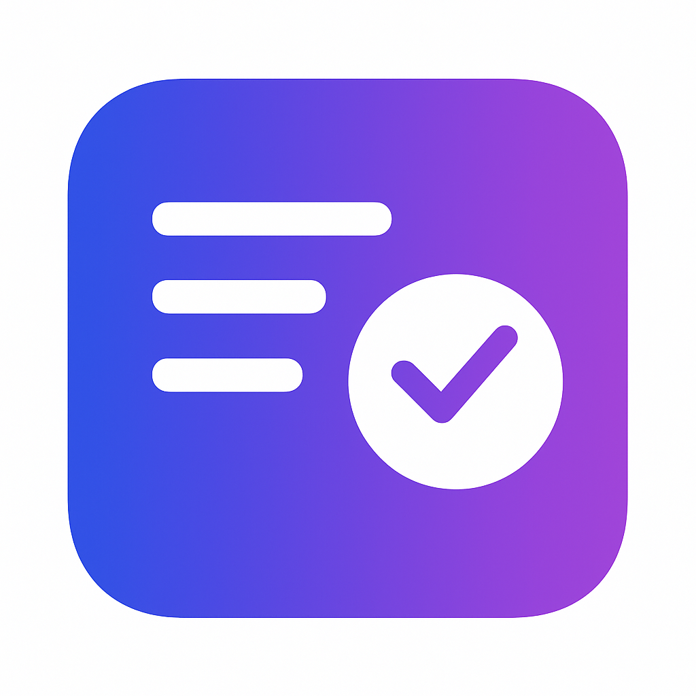

# CodeSnipex

<p align="center">
  
</p>

**Transform code into learning opportunities with AI-powered practice questions and quizzes**

CodeSnipex is a Chrome extension that helps developers and students learn from code they encounter on the web. Select any code snippet on a webpage, and CodeSnipex will use Google's Gemini AI to generate practice questions, syntax challenges, and multiple-choice concept questions to reinforce your understanding.

## Features

- 🧠 **AI-Powered Question Generation**: Uses Google's Gemini AI models to create relevant practice questions from any code snippet
- 📝 **Two Question Types**: 
  - **Syntax MCQs**: Test your knowledge of language syntax and structure
  - **Concept MCQs**: Assess your understanding of programming concepts and patterns
- 📱 **Dual Interface Options**:
  - **Popup Mode**: Quick access in a popup window
  - **Side Panel Mode**: Persistent view alongside your browsing
- 🖱️ **Easy Selection**: Right-click context menu or manual input options
- 🌐 **Works Everywhere**: Functions on any website with code
- ⚡ **Visual Feedback**: Immediate feedback for correct/incorrect answers
- ⚙️ **Configurable**: Choose between different Gemini models for question generation
- 🔐 **Privacy Focused**: Your code stays private with API keys you control

## Installation

1. **Download the Extension**:
   - Clone this repository or download the ZIP file
   - Extract to a location on your computer

2. **Load in Chrome**:
   - Open Chrome and navigate to `chrome://extensions/`
   - Enable "Developer mode" in the top-right corner
   - Click "Load unpacked" and select the extracted extension folder

3. **Configure API Keys**:
   - Click the extension settings icon
   - Add your Gemini API key
   - Select your preferred Gemini model

## Usage

### Generate Questions from Web Code

1. Find code on any webpage
2. Select the code snippet you want to learn from
3. Right-click and select "Generate Practice Questions" from the context menu
4. View the generated questions in the popup or side panel

### Generate Questions from Your Code

1. Click the CodeSnipex icon in your browser toolbar
2. Paste your code in the input field
3. Click "Generate Questions"
4. Explore the generated practice questions

### Using the Side Panel

1. Click the side panel icon in the popup
2. The side panel will open alongside your current page
3. Navigate through questions while keeping your original content visible

## Question Types

### Syntax MCQs

These questions focus on language syntax, proper code structure, and common coding patterns. They help reinforce your understanding of the programming language's rules and conventions.

### Concept MCQs

These questions assess your understanding of the underlying concepts, design patterns, and purpose of the code. They help you think about the "why" behind code structures.

## Configuration

### AI Model Selection

CodeSnipex supports multiple Gemini AI models:

- **Gemini 2.5 Flash** (default)
- **Gemini 2.0 Flash**
- **Gemini 2.0 Flash Lite**
- **Gemini 1.5 Flash**
- **Gemini 1.5 Flash 8B**

To change models:
1. Click the model indicator in the popup header
2. Select your preferred model from the dropdown

### API Keys

To use CodeSnipex, you need to provide your own Gemini API key:

1. Get an API key from [Google AI Studio](https://makersuite.google.com/)
2. Open extension settings
3. Enter your API key in the appropriate field

#### Default API Key

 you have to set a default API key directly in the config.js file:

1. Open the `config.js` file in your code editor
2. Find the `DEFAULT_KEY` property for each model:
   ```javascript
   GEMINI_25_FLASH: {
     provider: 'google',
     id: 'gemini-2.5-flash',
     label: '2.5 Flash',
     BASE_URL: 'https://generativelanguage.googleapis.com/v1/models',
     DEFAULT_KEY: 'YOUR_API_KEY_HERE'
   },
   ```
3. Replace `'YOUR_API_KEY_HERE'` with your actual Gemini API key
4. Save the file and reload the extension in Chrome

This approach is useful for development or when deploying the extension to a team that should share the same API key.

## Privacy

CodeSnipex values your privacy:

- Your code is only sent to Google's Gemini AI service
- API calls are made directly from your browser to Google
- No data is stored on external servers
- Your API keys are stored securely in your browser's local storage

## Contributing

Contributions are welcome! Feel free to submit issues or pull requests.

## License

[MIT License](LICENSE)

---

Made with ❤️ for developers and students learning to code 